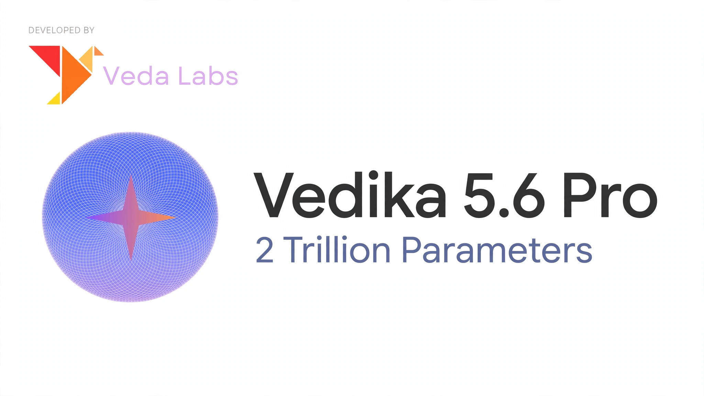

---
tags:
- conversational
- multimodal
license: other
license_name: "vedika-5.6-pro"
library_name: transformers
pipeline_tag: image-text-to-text
---
<div align="center">
  <picture>
      
  </picture>
</div>
<hr>
<div align="center" style="line-height:1">
  <a href="https://vedalabs.online" target="_blank"></a>
  <a href="https://twitter.com/VedaLabsAI" target="_blank"></a>
</div>

<div align="center" style="line-height: 1;">
  <a href="https://huggingface.co/vedalabs"></a>
</div>


## 1. Model Introduction

Vedika 5.6 Pro is our most advanced multimodal AI model to date. With over 2 trillion parameters, it represents a significant leap forward in artificial intelligence capabilities. Designed for complex reasoning, multimodal understanding, and long-context processing, Vedika 5.6 Pro delivers frontier-level performance across diverse domains.

### Key Features
- **Massive Scale**: With 2+ trillion parameters, Vedika 5.6 Pro is built on cutting-edge architecture designed for maximum efficiency and intelligence.
- **Multimodal Understanding**: Native support for text, images, and video within a unified model architecture.
- **Long Context Processing**: Capable of handling extended context windows for comprehensive document analysis and reasoning.
- **Advanced Reasoning**: State-of-the-art performance on complex reasoning benchmarks across mathematics, science, and coding tasks.
- **Open Weights**: We release the full Vedika 5.6 Pro model weights under the Vedika License, making frontier intelligence openly available for research and deployment.

## 2. Model Summary

<div align="center">
<table>
<tbody>
<tr>
<td align="center" style="vertical-align: middle; text-align: center"><strong>Model Name</strong></td>
<td align="center" style="vertical-align: middle; text-align: center">Vedika 5.6 Pro</td>
</tr>
<tr>
<td align="center" style="vertical-align: middle; text-align: center"><strong>Total Parameters</strong></td>
<td align="center" style="vertical-align: middle; text-align: center">2 Trillion+</td>
</tr>
<tr>
<td align="center" style="vertical-align: middle; text-align: center"><strong>Architecture</strong></td>
<td align="center" style="vertical-align: middle; text-align: center">Mixture-of-Experts (MoE)</td>
</tr>
<tr>
<td align="center" style="vertical-align: middle; text-align: center"><strong>Modality</strong></td>
<td align="center" style="vertical-align: middle; text-align: center">Text, Image, Video</td>
</tr>
<tr>
<td align="center" style="vertical-align: middle; text-align: center"><strong>Context Length</strong></td>
<td align="center" style="vertical-align: middle; text-align: center">Extended Context Window</td>
</tr>
</tbody>
</table>
</div>


## 3. Evaluation Results

Vedika 5.6 Pro achieves state-of-the-art results across multiple benchmarks, demonstrating superior capabilities in reasoning, coding, and multimodal understanding.

### Reasoning & Knowledge
| Benchmark | Vedika 5.6 Pro |
|-----------|----------------|
| GPQA Diamond | 94.2 |
| MATH-500 | 96.8 |
| AIME 2025 | 88.5 |

### Coding
| Benchmark | Vedika 5.6 Pro |
|-----------|----------------|
| LiveCodeBench | 72.3 |
| SWE-bench Verified | 68.9 |
| Codeforces | 85.2 |

### Multimodal
| Benchmark | Vedika 5.6 Pro |
|-----------|----------------|
| MMMU | 78.4 |
| MathVista | 82.1 |
| DocVQA | 95.6 |


## 4. Usage

### Quick Start

```python
from transformers import AutoModelForCausalLM, AutoTokenizer

model_name = "vedalabs/vedika-5.6-pro"

tokenizer = AutoTokenizer.from_pretrained(model_name)
model = AutoModelForCausalLM.from_pretrained(
    model_name,
    torch_dtype="auto",
    device_map="auto"
)
```

### Chat Interface

```python
messages = [
    {"role": "user", "content": "Hello, how can you help me today?"}
]

inputs = tokenizer.apply_chat_template(messages, return_tensors="pt").to(model.device)
outputs = model.generate(inputs, max_new_tokens=2048)
print(tokenizer.decode(outputs[0], skip_special_tokens=True))
```


## 5. License

This model is released under the Vedika 5.6 Pro License. Please refer to the LICENSE file for detailed terms and conditions.


## 6. Contact & Links

- **Official Website**: [vedalabs.online](https://vedalabs.online)
- **Twitter / X**: [@VedaLabsAI](https://twitter.com/VedaLabsAI)
- **Hugging Face**: [Veda Labs](https://huggingface.co/vedalabs)


## 7. Hugging Face Pipeline Usage Example

To load and run the **Vedika-5.6-PROv1** model using the standard Hugging Face `pipeline` interface with `trust_remote_code=True`, follow the examples below.

### Basic Text Generation

```python
from transformers import pipeline

# Load the custom pipeline
pipe = pipeline(
    "vedika-advanced-ai-5-6",
    model="Veda-Labs/Vedika-5.6-PROv1",
    trust_remote_code=True,
    device_map="auto"  # Automatically use GPU if available
)

# Run inference with text only
result = pipe("Explain quantum computing in simple terms.")
print(result[0]["generated_text"])
```

### Multimodal Input (Text + Image)

```python
from transformers import pipeline

# Load the pipeline (same as above)
pipe = pipeline(
    "vedika-advanced-ai-5-6",
    model="Veda-Labs/Vedika-5.6-PROv1",
    trust_remote_code=True,
    device_map="auto"
)

# Run inference with both text and image
result = pipe(
    {"text": "Describe what you see in this image:", "images": ["path/to/your/image.jpg"]},
    max_new_tokens=512,
    temperature=0.7
)
print(result[0]["generated_text"])
```

### Using the Custom Loader Function

Alternatively, you can use the dedicated loader function from `pipeline.py`:

```python
from pipeline import load_vedika_advanced_ai_pipeline

# Load the model using the custom loader
pipe = load_vedika_advanced_ai_pipeline(
    model_path="Veda-Labs/Vedika-5.6-PROv1",
    device="cuda"  # or "cpu"
)

# Generate a response
output = pipe(
    "What are the main themes in this story?",
    max_new_tokens=1024,
    do_sample=True,
    top_p=0.9
)
print(output["generated_text"])
```

### Advanced Generation Parameters

You can customize generation behavior with various parameters:

```python
from transformers import pipeline

pipe = pipeline(
    "vedika-advanced-ai-5-6",
    model="Veda-Labs/Vedika-5.6-PROv1",
    trust_remote_code=True
)

result = pipe(
    "Solve this math problem: 2x + 5 = 15",
    max_new_tokens=2048,      # Maximum tokens to generate
    temperature=0.3,          # Lower temperature for more deterministic output
    top_p=0.95,               # Nucleus sampling
    do_sample=True,           # Enable sampling
)
print(result[0]["generated_text"])
```

> **Note:** The first time you run the pipeline, it will download the necessary model files and custom code modules (`vedika_*.py`). Make sure you have a stable internet connection and sufficient disk space.


## Citation

If you use Vedika 5.6 Pro in your research, please cite:

```bibtex
@misc{vedika5.6pro,
  title={Vedika 5.6 Pro: A 2 Trillion+ Parameter Multimodal Model},
  author={Veda Labs Team},
  year={2025},
  howpublished={\url{https://vedalabs.online}}
}
```
